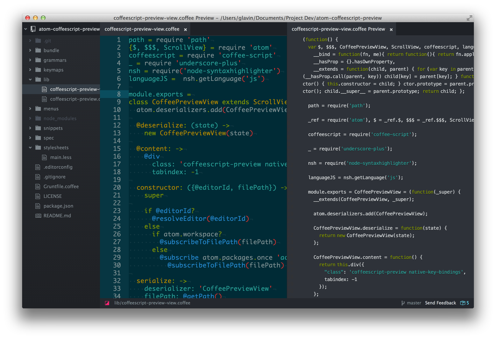

# [CoffeeScript Preview for Atom](https://github.com/Glavin001/atom-coffeescript-preview)

Atom Package: https://atom.io/packages/coffeescript-preview

```bash
apm install coffeescript-preview
```

Or Settings/Preferences ➔ Packages ➔ Search for `coffeescript-preview`

## Screenshot



## Features

- [x] Preview CoffeeScript as JavaScript in tab
- [x] Live updating of preview
- [x] Shows loading and error messages

[npm]: https://www.npmjs.org/package/generator-atom-package
[atom-doc]: https://atom.io/docs/latest/creating-a-package "Official documentation"
